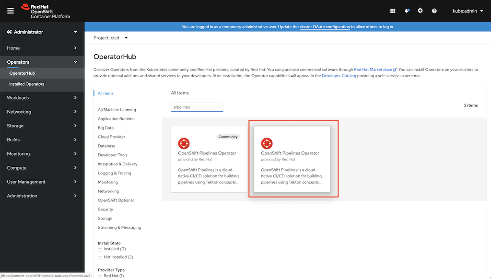

# Setup: Installing OpenShift Pipelines

OpenShift Pipelines, as you might have guessed, is installed with an Operator from the OpenShift OperatorHub catalog.

## Install the OpenShift Pipelines Operator

First, login to your OpenShift cluster as an admin user.  Once logged in:
* In the top-left corner of the UI, make sure you have the "Administrator" dashboard selected.
* In the left navigation panel, select **Operators -> OperatorHub**
* In the keyword filter, type "Pipelines".
* You should now see OpenShift Pipelines Operator (1.0 or newer, do not choose the "Community" operator, it's old)

* Click on *OpenShift Pipelines Operator*, then **Install**.
* Keep the default *subscription* settings, then cick **Subscribe**

OpenShift Pipelines will now install and your cluster will be ready to create and run pipelines!

[Next: What's in a Pipeline?](02-pipeline-intro.md)

